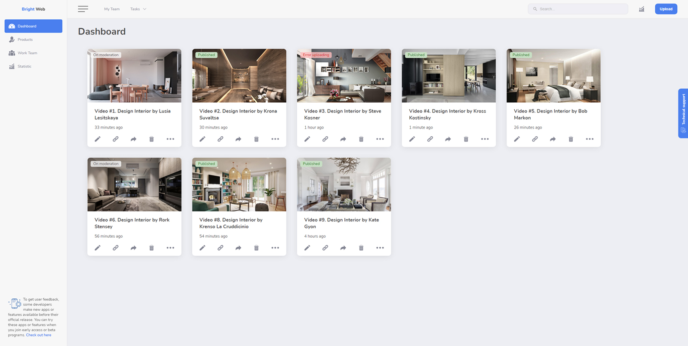

# Страница личного кабинета видео-хостинга

Самостоятельно выполненный проект в рамках обучения на курсе "Профессия Frontend-Разработчик" в онлайн-школе "Айтилогия".

## Внешний вид

## Выполненные задачи:
- Вёрстка веб-страницы по макету;
- Практика применения CSS-стилей, CSS-псевдоклассов, CSS Flexbox.

## Используемые технологии:
* HTML
* CSS